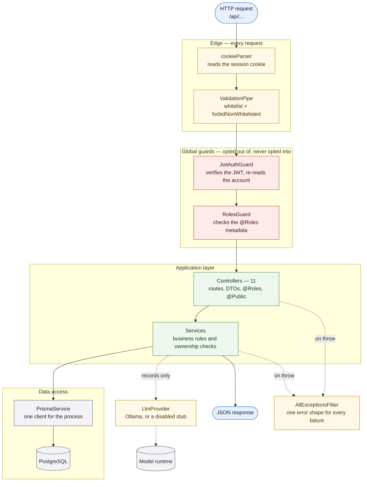

# Components

This level opens the API container and shows how a request travels through it.
The shape is the same for every one of the API's fifty-eight routes, which is
the point: there is exactly one path in, and the authorization decisions happen
before any handler code runs.

## The five layers

**The edge.** Two things touch every request before any Nest code does.
`cookieParser` turns the session cookie into a value the guards can read, and the
`ValidationPipe` enforces the DTO a route declares — rejecting unknown fields
rather than ignoring them, and stopping at the first failure per field so the
error reads as one sentence rather than three overlapping complaints.

**The guards.** Authentication and authorization run here, globally, before any
handler. `JwtAuthGuard` verifies the signed session token *and* re-reads the
account row on every request. That extra read is deliberate: it is what lets an
administrator suspend an account and have it take effect on that account's very
next request, which a stateless token cannot do on its own. `RolesGuard` then
checks the roles the route declared.

The direction of the default matters. Both guards are applied to the whole
application, and a route opts *out* with `@Public()`. A new controller is
therefore protected unless its author says otherwise, rather than open until
somebody remembers to protect it.

**The controllers.** Eleven of them, one per HTTP surface, grouped into twelve
modules. A controller's job is to declare a route, name the DTO that describes
its body, and state who may call it. It holds no business rules.

**The services.** Where the rules live — whether this patient owns this
appointment, whether this doctor took part in this consultation, whether this
slot is actually offered. Ownership checks sit next to the query that needs
them, so a caller cannot reach a record by knowing its identifier.

**Data access.** `PrismaService` is the single gateway to PostgreSQL. It is also
what `openapi:emit` has to satisfy: instantiating the application opens this
connection, which is why generating the API description needs a database
available.

## The two branches off the main path

**The model runtime.** Only the records module reaches it, through an
`LlmProvider` abstraction with two implementations — one that talks to Ollama and
one that is simply disabled. Which one is bound is decided by configuration at
startup, so the rest of the application never has to ask whether generation is
available; it asks the provider and gets an answer.

**The exception filter.** Every failure — a thrown `HttpException`, a validation
error, an unexpected crash — leaves through one filter and arrives as the same
JSON shape. A client never has to distinguish "the API said no" from "the API
broke" by inspecting the response's structure.

## Why this shape

A route that needs authorization metadata cannot forget to add it, because the
metadata is read from decorators the guards already consult. The
[API reference](/api/) is generated by walking these same controllers, so the
document describes the routes that exist rather than the routes someone meant to
write.
