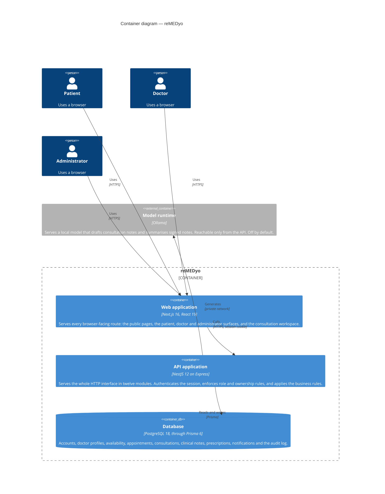

# Containers

Opening the system box: the separately running pieces, and the protocols
between them. A "container" here is anything that runs as its own process —
which, in this system, means three applications and a database.

## The containers

**Web application — Next.js.** Every browser-facing route lives here: the public
marketing and legal pages, registration and sign-in, the patient, doctor and
administrator surfaces, and the consultation workspace. It holds no business
rules of its own. Where a rule matters — whether a consultation can be joined,
whether this doctor may write this note — the interface reflects a decision the
API has already made, and the API re-checks it on every request.

**API application — NestJS.** The whole HTTP interface, in twelve modules. This
is where identity, authorization and the business rules actually live. It is
also the only container that talks to the database and the only one that reaches
the model runtime.

**Database — PostgreSQL.** A single relational database holding all persistent
state, reached through Prisma. It is the only stateful container: the applications
hold no durable state of their own, which is what lets either be restarted or
redeployed without losing anything.

**Model runtime — Ollama.** A separate process serving a local model. It is a
container in the deployment sense but not part of the request path for anything
except clinical assistance: if it is absent, the API starts normally and the
assist surfaces report themselves unavailable.

## The connections worth noting

**Web to API over a session cookie.** The browser sends the session as an
`httpOnly` cookie, not a bearer token, so no script on the page can read it. The
API accepts exactly one origin, set by `WEB_ORIGIN`, and requires credentials on
that origin.

**API to database through Prisma only.** No other container opens a database
connection. The schema, the migrations and the client all live with the API.

**API to model over a private network.** The model runtime is never reachable
from the internet. Locally it is a container on the compose network with no
published host port; on Fly.io it is an app given only a private address, so
even though it declares a listening port, that port is on the internal network.
Nothing outside the deployment can call it.

## What is deliberately absent

There is no cache, no message queue, no search index and no object store. Every
one of those would add a container to operate in exchange for a performance
property this system does not yet need. The single exception is the derived
slot computation, which is done on read rather than cached — see
[scheduling](/modules/availability).
