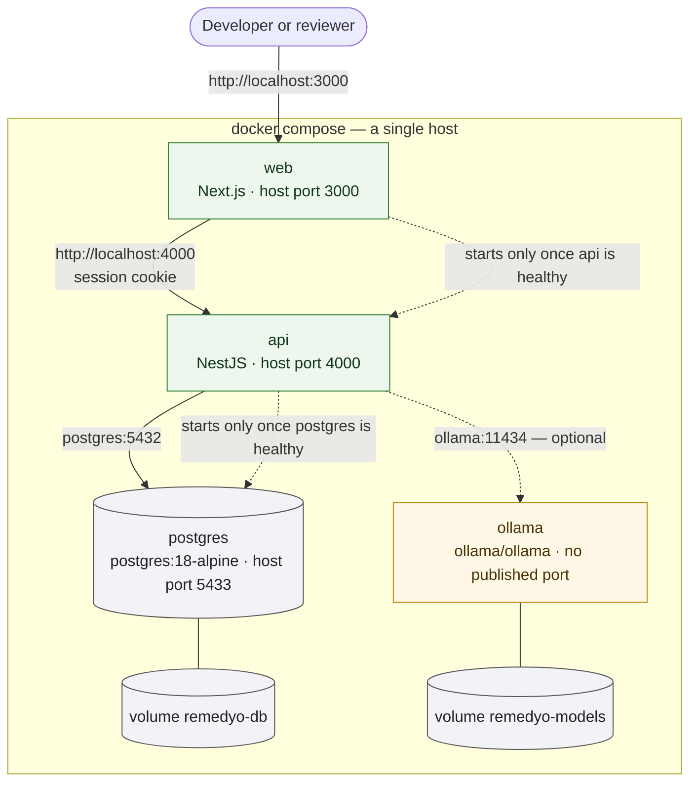
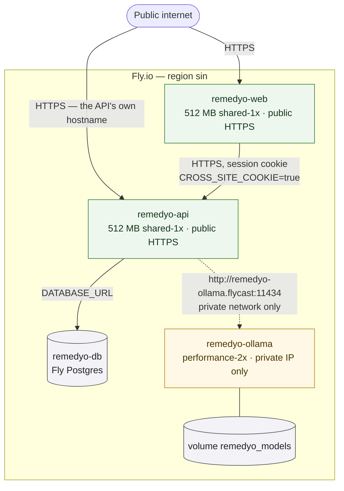

# Deployment

The repository supports exactly two deployment shapes, and both are described
here. They are not interchangeable configurations of one design: they differ in
how the containers reach each other, and one difference — whether the browser
treats the web app and the API as the same *site* — has a real consequence for
how sessions are delivered.

## Shape 1: `docker compose`, one host

The local shape, and the one a reviewer meets first: `docker compose up --build`
brings up Postgres, waits for it to be genuinely healthy, applies migrations,
seeds demonstration data, and serves the application. There is no second terminal
and no manual step.

Two things about this shape are worth stating.

**Postgres is on the critical path; the model is not.** The API declares a
dependency on Postgres being healthy and deliberately declares none on the model
runtime, whose first boot pulls roughly two gigabytes. The application is fully
usable throughout that pull — the assist surfaces simply report unavailable until
the model is there. The API's own healthcheck is `/api/health`, which also
reports whether a `SELECT 1` succeeds, so the web app starts only once the API
can actually reach its database.

**The web app and the API share a site.** Both are on `localhost`, and a port
does not make a site, so the session cookie's default `SameSite=Lax` is sent on
the web app's requests to the API. This is the stronger cookie posture and the
one this shape gets for free.

## Shape 2: Fly.io, separate apps, region `sin`

The deployed shape. Three Fly apps, one of them private, plus a Fly Postgres
instance.

**The model runtime is genuinely private, but read the mechanism carefully.** The
service block does declare port 11434 — Fly requires a port to be declared — but
the app is allocated *only* a private IPv6 address (`fly ips allocate-v6
--private`), so that port listens on Fly's internal network and nowhere else.
Privacy comes from the address, not from the absence of a port. The model is
reachable only from other apps in the same organisation, at
`remedyo-ollama.flycast:11434`, and the API is the only thing that calls it.

Worth verifying after a deploy rather than assuming: `fly ips list --app
remedyo-ollama` should show a private address and no public one. If a public
address was allocated by mistake, the model is on the internet and the address
should be released.

**This shape needs a different cookie setting, and that is not a preference.**
`remedyo-web.fly.dev` and `remedyo-api.fly.dev` look like sibling subdomains, but
`fly.dev` is on the Public Suffix List, so browsers treat them as two different
*sites*. A `SameSite=Lax` cookie is discarded on that cross-site request, which
makes every login succeed and then appear to fail. The API therefore runs with
`CROSS_SITE_COOKIE=true`, which sets `SameSite=None; Secure`.

The cost is real and is stated rather than hidden: with `SameSite=None` the
cookie rides along on cross-site requests, so CSRF no longer has SameSite as a
backstop. What remains is the single allowed CORS origin and the fact that every
mutating route requires a JSON body, which forces a preflight a foreign origin
cannot pass. Serving both behind one hostname would remove the trade-off
entirely, and is the better long-term fix.

**Clinical assist is off here by default.** `LLM_ENABLED=false` on the API app
means the assist surfaces are absent. Turning it on requires deploying the model
app, which needs a memory size no shared-CPU instance provides — the model
runtime is the one component with a real hosting cost. The comment in
`apps/ollama/fly.toml` states that cost plainly rather than leaving it to be
discovered on a bill.

**One machine is held running on the API** so that the migrate-and-seed start
command cannot run concurrently on two machines against the same database. The
web app is allowed to scale to zero.

## What both shapes share

The same three images and the same configuration surface: `DATABASE_URL`,
`JWT_SECRET`, `WEB_ORIGIN`, `CROSS_SITE_COOKIE`, `LLM_ENABLED`, `LLM_BASE_URL`
and `LLM_MODEL`. Nothing about the application's behaviour is decided by which
shape it is running in — only how the containers find each other, and whether
the browser considers them one site.
