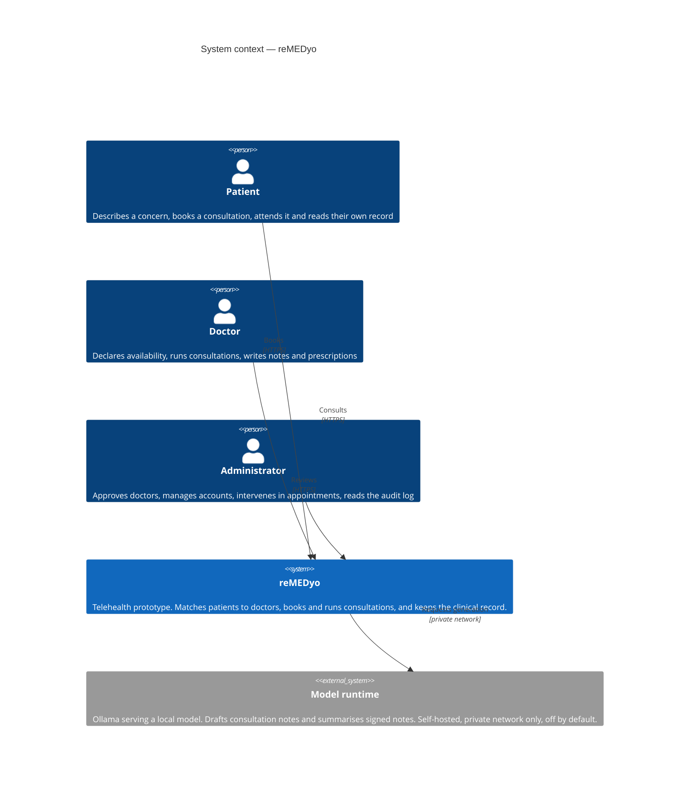

# System Context

The outermost view: the people who use the system, the system itself, and the
one external thing it depends on. Everything inside reMEDyo is deliberately
collapsed into a single box here — the point of this level is to establish the
boundary and nothing more.

## What this level says

**Three human actors, one system.** The three roles are not variations on one
kind of user: they register differently (patients and doctors self-register,
administrators are pre-provisioned), they see different surfaces, and they are
restricted at the API rather than in the interface.

**One external dependency, and it is optional.** The model runtime is the only
thing outside the system's own boundary. It is self-hosted rather than a hosted
service, it is reachable only from the API over a private network, and the
product runs completely without it. Nothing else is called: there is no payment
provider, no email or SMS gateway, no push service and no third-party
authentication.

**Everything clinical is inside the boundary.** Matching, booking, the
consultation workspace and the medical record are all first-party. A patient's
data does not leave the deployment, which is what makes the prototype's
fictional-data position defensible rather than merely asserted.

## Where the pieces live

This diagram deliberately shows nothing about how the system is built. The next
level, [Containers](/architecture/containers), opens the box.
