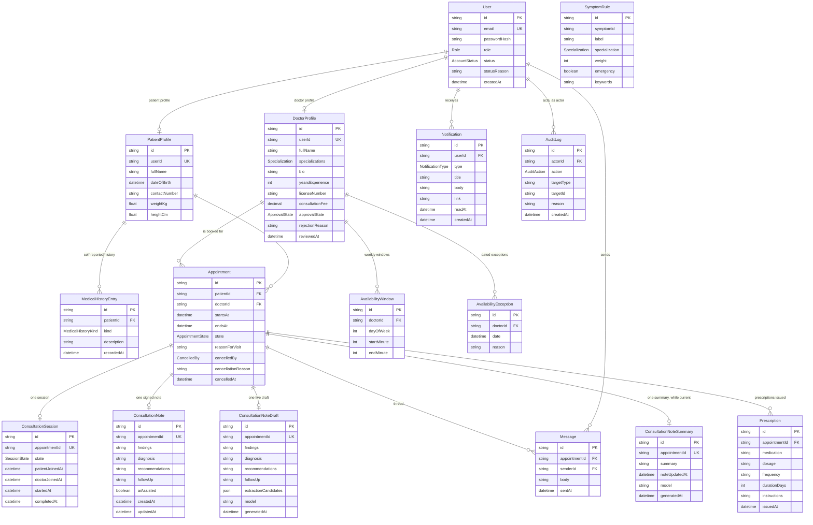

# Entity relationship model

The persisted model is sixteen entities and ten enumerations, defined in
`apps/api/prisma/schema.prisma`. This page is derived from that file; the
[enumerations](/data-model/enums) and [constraints](/data-model/constraints)
pages cover the rest.

`SymptomRule` has no relation to anything: it is seeded reference data that the
matching rules read, not something a user creates.

## Two decisions that shape everything

Both are stated at the top of `schema.prisma`, and both are visible in the
diagram above.

**Role-specific fields live in their own table.** A patient has a date of birth,
measurements and a medical history; a doctor has specializations, a license
number and an approval state. The two share credentials and identity in `User`
and nothing else. The alternative — one wide profile table with columns that are
null for half the rows — would mean every doctor query carrying patient fields
it can never use, and every constraint needing a role check to be meaningful.

**Notes and prescriptions reference the appointment, not the patient.** This is
the load-bearing decision. "Who may read this note" is answered by asking who the
appointment's two participants are, which is exactly how the medical-records
capability defines access. Referencing the patient instead would make the
question "which doctor wrote this, and were they treating this patient" a
separate lookup that could disagree with the appointment.

## Nothing is hard-deleted

The schema has no delete path for clinical or administrative history.
Appointments carry a `CANCELLED` state rather than disappearing; notes are
revised in place and keep their identity; audit entries are insert-only. The API
exposes no `DELETE` route for any of them — the absence of the route is the
enforcement, not a convention.

Four groups of rows do cascade when their parent goes: a `User`'s two profiles
and their notifications; a `PatientProfile`'s history; a `DoctorProfile`'s
availability; and an `Appointment`'s session, message thread, note, draft,
summary and prescriptions. See [constraints](/data-model/constraints) for the
full list, and for the four relations that deliberately do *not* cascade —
among them a message's author, whose link must survive its sender.

## Where the model is deliberately thin

**Derived values are not stored.** Age comes from `dateOfBirth`, bookable slots
come from windows and exceptions, and a missed appointment comes from its join
window closing. Every one of those is computed on read. Nothing has to run on a
schedule to keep the data consistent, and no stored value can disagree with what
it was derived from.

**Generated content is stored separately from the record.** A draft and a
summary each get their own table, distinct from `ConsultationNote`. That
separation is what makes "no generated text reaches the medical record without a
clinician's save" a structural property rather than a rule someone has to
remember — the note table is written by exactly one route, and no model writes
to it.
