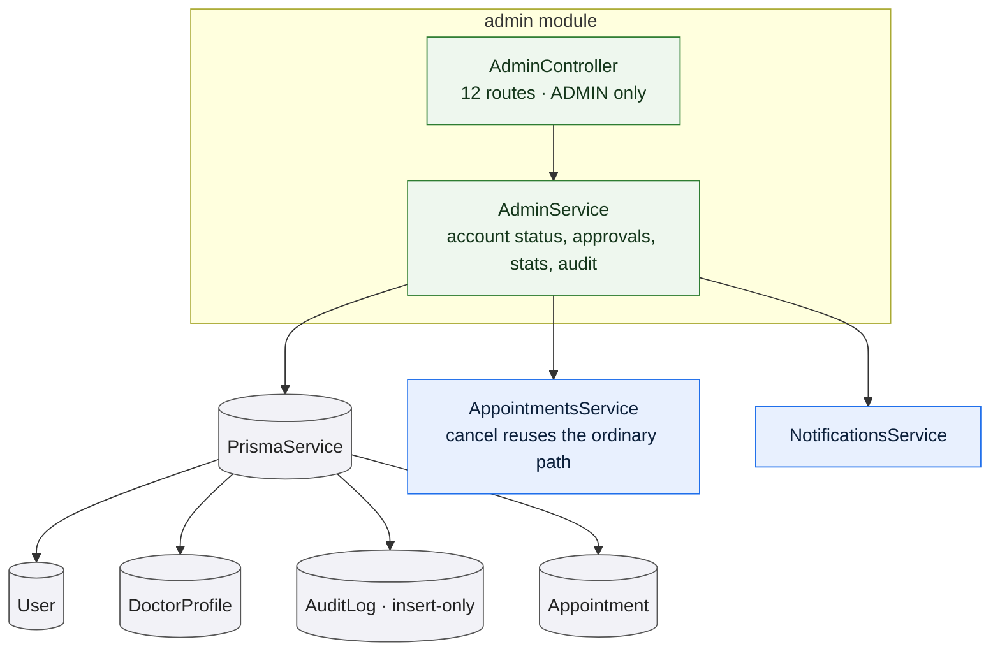

# `admin`

Owns the operator surface: listing and acting on accounts, reviewing doctor
applications, correcting a doctor's specializations, intervening in appointments,
dashboard counts, and reading the audit log.

Every route is administrator-only, declared once at the controller level. The
module owns no table of its own — each mutation pairs one domain write with one
audit insert.

## What is audited, and what is not

This is the module's most important distinction, and it is a deliberate design
choice rather than an omission.

**Audited** — every action that changed something:

| Action | Recorded as |
| --- | --- |
| Activate an account | `ACCOUNT_ACTIVATED` |
| Suspend an account | `ACCOUNT_SUSPENDED`, with the reason |
| Deactivate an account | `ACCOUNT_DEACTIVATED`, with the reason |
| Approve a doctor | `DOCTOR_APPROVED` |
| Reject a doctor | `DOCTOR_REJECTED`, with the reason |
| Correct specializations | `DOCTOR_SPECIALIZATION_UPDATED` |
| Cancel an appointment | `APPOINTMENT_CANCELLED`, with the reason |

**Not audited** — listing accounts, reading the review queue, listing
appointments, the dashboard, and reading the audit log itself. The log records
what an administrator *changed*, not what they looked at. A log of every page
view would be large, would say very little, and would make the entries that
matter harder to find.

## Account status

Three states, and the endpoint is a **setter rather than a state machine**: any
of active, suspended or deactivated may be set from any other. There is no
transition matrix, because there is no transition an administrator should be
forbidden from making.

Two rules apply:

- **Administrator accounts cannot be changed here.** Attempting it is a `400`.
- **A reason is required for anything but activation.** Suspending or
  deactivating without one is refused; activating needs no justification.
  Activating an account also clears the previous suspension reason, so a
  reactivated account does not carry a stale explanation.

Suspension takes effect on the account's next request, because the
[authentication guard](/modules/auth) re-reads the status every time rather than
trusting the token.

## Doctor approval

The review queue shows pending applications oldest first. Approving sets the
state, records the review time, and **clears any previous rejection reason**, so
a doctor who was once rejected and is later approved does not carry the old
explanation.

Rejecting requires a reason, which the doctor sees on their own profile.

Neither decision is guarded by the doctor's current state, so calling approve on
an already-approved doctor succeeds and writes a second audit entry. The queue
only offers pending applications, so the interface never presents that, but the
API permits it.

A rejection is not revisited: nothing returns a rejected profile to the queue.
The doctor may edit their profile, but editing does not reset the approval state,
so a rejected application stays rejected unless an administrator approves it.

## Correcting specializations

The only way a doctor's specialization list changes after submission. Doctors
choose from an application-defined list and cannot invent a value, so an
administrator who spots a mistake corrects it here.

It is the one doctor-profile mutation that sends **no notification**.

## Appointment intervention

Administrators can list appointments across all accounts — capped at the most
recent 200, with no pagination — and cancel one.

Cancellation delegates to the same service the patient and doctor routes use, so
it releases the slot and notifies both parties identically. The only difference
is that `cancelledBy` is recorded as `ADMIN`.

The refusal to cancel an already-completed appointment is enforced by that shared
service, not here.

## Dashboard counts

Four numbers: patients, doctors, doctors awaiting review, and completed
consultations. Plus a breakdown of appointments by state, which is pre-filled
with zeros so an empty deployment shows zeroes rather than missing keys.

Two things worth knowing about the counts:

- Patient and doctor counts **include suspended and deactivated accounts**. They
  count accounts, not active users.
- Completed consultations are counted from the consultation sessions, a different
  table from appointments.

## Reading the audit log

Filterable by actor and by action, newest first, capped at 200 entries with no
pagination and no date filter. Each entry names the actor, the action, the kind
of record acted on, the record's id, the reason where one was given, and when.

The actor's display name is resolved from their doctor profile, then their
patient profile, then their email — which is why an administrator appearing as an
actor shows as an email address: administrators have neither profile.

## Rules and invariants

- Every route is administrator-only.
- The audit log is insert-only. No update or delete path exists anywhere in the
  API.
- Account status cannot be changed for an administrator account.
- Actions that change something record why, where a reason is meaningful.

## Data model slice

| Model | Use |
| --- | --- |
| `User` | Reads and writes `status` and `statusReason`. |
| `DoctorProfile` | Writes `approvalState`, `rejectionReason`, `reviewedAt`, `specializations`. |
| `AuditLog` | Insert-only. `targetType` is a plain string — `'User'`, `'DoctorProfile'` or `'Appointment'` — rather than an enumeration. |
| `Appointment` | Read for the cross-account listing; the write itself goes through the appointments module. |
| `ConsultationSession` | Counted, for the completed-consultations figure. |

Relevant enumeration: [`AuditAction`](/data-model/enums#auditaction). Two of its
values — `NOTE_DRAFT_GENERATED` and `RECORD_SUMMARY_GENERATED` — are written by
[records](/modules/records), not here.
