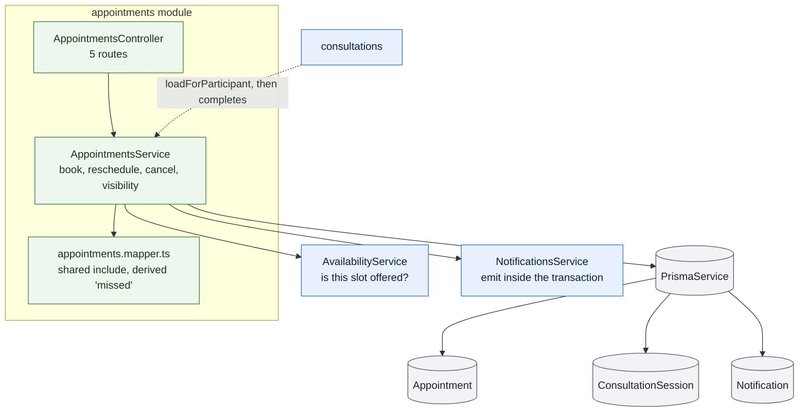

# `appointments`

Owns the appointment lifecycle from the patient's side: booking against a
derived slot, patient-initiated rescheduling, and cancellation by either
participant. Each operation writes its notifications inside the same transaction
as the change that caused them.

It does **not** own the transition to completed. An appointment is completed by
the doctor ending the consultation, which happens in
[consultations](/modules/consultations) — so this module's state machine is only
complete when read alongside that one.



## The state machine

`SCHEDULED` is the only non-terminal state. From it:

| Transition | Performed by | Condition |
| --- | --- | --- |
| → `CANCELLED` | either participant | not already completed or cancelled |
| → `COMPLETED` | the doctor, in `consultations` | the session was joined |
| → `SCHEDULED` (moved) | the patient | reschedule to another offered slot |

`COMPLETED` and `CANCELLED` are terminal: no route leaves either.

Cancellation has **no time restriction**. The state decides, not the clock, so an
appointment whose start has passed can still be cancelled — the appointment that
was never held is reported as missed rather than closed.

## Booking

A booking is refused unless all of these hold, in this order:

1. The caller has a patient profile.
2. That profile has a name and a date of birth — a doctor cannot be sent into a
   consultation with no idea who they are seeing.
3. The doctor is approved **and** their account is active.
4. The requested instant parses, and is in the future.
5. **The instant appears in the doctor's currently derived slots.**

That last check is the important one. It is a single call to
`AvailabilityService.slotsFor`, and it subsumes every narrower rule at once —
inside a window, not on a blocked date, on the 30-minute grid, not in the past,
and not already held. Because the check is against derived slots rather than
against raw windows, there is no second implementation of "is this bookable"
that could disagree with the first.

The insert, the new `ConsultationSession` row, and the notifications for both
parties all happen in **one transaction**, so a rollback leaves no partial
booking and no notification claiming one succeeded.

## Preventing double-booking

Two layers, and only the second is authoritative.

**In the service**, the slot check above already excludes slots held by
`SCHEDULED` appointments — which handles the ordinary case and returns a clear
message.

**In the database**, two partial unique indexes decide the race:

```sql
UNIQUE (doctorId, startsAt) WHERE state = 'SCHEDULED'
UNIQUE (patientId, startsAt) WHERE state = 'SCHEDULED'
```

Two simultaneous bookings both pass the service check and both attempt the
insert; one commits, the other takes a unique violation, which the API translates
into `409 Conflict`. A check-then-insert in application code cannot do this — it
loses the race by construction.

The `WHERE` clause is what keeps the rule fair: restricting the index to
`SCHEDULED` rows means a cancelled slot is released. Without it, a cancelled
09:00 would reserve 09:00 forever. See
[constraints](/data-model/constraints#two-partial-unique-indexes-added-by-migration).

The two indexes are told apart by their names, so that a doctor-side conflict
("Someone just took that slot") reads differently from a patient-side one ("You
already have a consultation at that time").

## Rescheduling

Only the patient may move an appointment, and only while it is `SCHEDULED` and
has not started. The new time must be one the **same** doctor currently offers —
the request carries no doctor id, so a reschedule cannot silently become a
change of doctor.

The update is in place, inside a transaction. That matters for the failure case:
if the new time turns out to be taken, the whole transaction aborts and the
original appointment is untouched — the original slot is never released into the
gap it would have left.

## Visibility

One helper, `loadForParticipant`, decides whether the caller may see an
appointment at all, and every route that takes an appointment id goes through it
except booking.

A caller who is neither participant gets `404`, not `403` — the response does not
confirm that the appointment exists. Administrators are explicitly allowed
through, for oversight.

Listing is scoped by role: a patient sees appointments where they are the
patient, everyone else sees appointments where they are the doctor. `past`
includes anything already started *or* completed *or* cancelled, so a cancelled
future appointment appears under `past`.

## Rules and invariants

- Booking is patient-only; rescheduling is patient-only; cancellation is open to
  both participants.
- An appointment is never deleted. Cancellation is a state.
- Notifications are written in the same transaction as the change.
- **Missed is derived, not stored.** An appointment whose join window has closed
  without completion is reported as missed at read time. Nothing sweeps the
  table on a schedule, and a missed appointment can still be joined — it is late,
  not closed.

## Data model slice

| Model | Use |
| --- | --- |
| `Appointment` | Written by all three operations. Depends on the two partial unique indexes above. |
| `ConsultationSession` | Created eagerly at booking, so a consultation always has a session row. |
| `Notification` | Written through `NotificationsService` inside the transaction. |
| `PatientProfile`, `DoctorProfile`, `User` | Read for the booking preconditions, and for the names shown in notifications. |

The read shape is defined once, in `APPOINTMENT_INCLUDE`, and reused by
consultations, records and admin — which is why an appointment looks identical
wherever it is returned.
