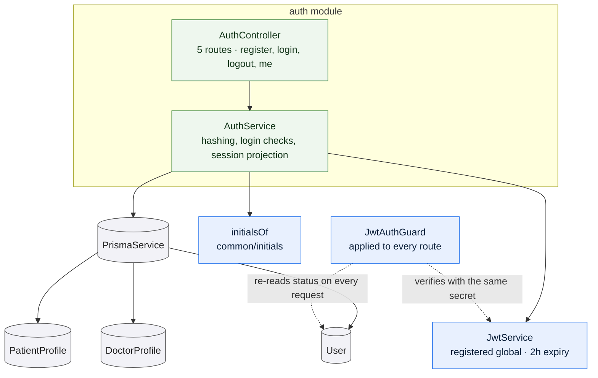

# `auth`

Owns identity: self-service registration for patients and doctors, credential
verification, session issuance, and the `SessionUser` projection every
authenticated surface reads. It is the only module that writes `User` rows and
the only one that creates a profile at registration.

It does **not** create administrator accounts — those are provisioned, not
registered — and it does not enforce authorization on any other module's routes.

## What it owns

**Registration.** Two routes, one per role. Both hash the password with argon2,
normalise the email to lower case and trim it, and create the `User` row and its
profile row **in one transaction** — a failed profile insert cannot leave an
orphan account behind.

A doctor registration always writes `approvalState: PENDING`. The client cannot
choose it, and nothing else in the API sets it: registration is the only path
into the review queue.

**Sign-in.** One shared failure message for both a wrong password and an unknown
email — *"That email and password combination is not correct."* On an unknown
email it still runs the password hash before failing, so the two cases take
similar time and the endpoint does not reveal which addresses are registered.

Account status is checked **after** the password is verified, and a suspended or
deactivated account gets a `403` naming the problem rather than a generic
`401` — the person has proven who they are, so telling them why they cannot get
in is more useful than pretending they mistyped.

**The session projection.** `SessionUser` is assembled here, and the two derived
fields are worth knowing:

- `profileComplete` — for a patient, a name and a date of birth are present; for
  a doctor, a name and at least one specialization. Administrators are always
  complete.
- `initials` — from the profile name, or the first two characters of the email
  when there is no name yet.

`approvalState` is included only when a doctor profile exists, so the field is
absent rather than null for patients and administrators.

## The session cookie

The token is a JWT delivered in an `httpOnly` cookie, so no script on the page
can read it. The cookie's lifetime is two hours.

`JwtAuthGuard` verifies that token and then **re-reads the account row**. That
extra read is what makes suspension take effect on the account's very next
request — a signed, unexpired token stops working the moment the status changes.
It is the mitigation for having no server-side revocation, and it is why
`auth` and the guard must agree on the signing secret.

`SameSite` is `Lax` by default and only becomes `None; Secure` when
`CROSS_SITE_COOKIE=true`, which the Fly.io deployment sets. The reasoning is
recorded in [Deployment](/architecture/deployment): on Fly the web app and the
API are separate *sites*, so a `Lax` cookie is discarded and every login
succeeds and then appears to fail.

## Rules and invariants

- Email is unique. A duplicate is a `409`, checked before the insert and again
  from the database's own unique violation — the second check is the real guard
  against two simultaneous registrations.
- Passwords are at least 8 characters, and at most 128.
- A doctor must supply a name, a license number, and at least one value from the
  application-defined specialization list. A doctor cannot invent one.
- Every registration signs the new account in immediately.

## Data model slice

| Model | Use |
| --- | --- |
| [`User`](/data-model/) | Reads and writes `email`, `passwordHash`, `role`, `status`. Depends on `email` being unique. |
| `PatientProfile` | Created at registration with the name, if one was given. |
| `DoctorProfile` | Created at registration with `approvalState: PENDING`, which the schema default also enforces. |

Relevant enumerations: [`Role`](/data-model/enums#role),
[`AccountStatus`](/data-model/enums#accountstatus),
[`ApprovalState`](/data-model/enums#approvalstate),
[`Specialization`](/data-model/enums#specialization).

Two things this module does **not** own, though they read like its concern:
account status is only ever *changed* by [admin](/modules/admin), and the doctor
approval decision is made there too.
