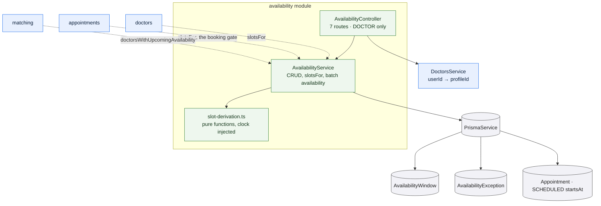

# `availability`

Owns two things: the schedule a doctor declares, and the conversion of that
schedule into the concrete slots a patient can book. It is the only module that
creates or removes availability, and the only place the slot-derivation
algorithm lives.

Slots are **computed on every read and never stored**. There is no generation
job, no slots table, and nothing that can drift out of step with the windows it
came from.

## What it owns

**Weekly windows.** A window is a day of the week and a start and end in minutes
from midnight, in the doctor's local time. Three rules apply when one is added:

- the end must be after the start;
- the window must be at least 30 minutes long;
- it must not overlap an existing window on the same day.

Overlap is tested half-open, so a window starting exactly when another ends is
allowed — they are adjacent, not overlapping.

**Dated exceptions.** A single date the doctor is unavailable, with an optional
reason, overriding the weekly pattern entirely. Re-blocking the same date
replaces the reason rather than failing, on the unique key
`(doctorId, date)`. The list returns only today onwards; earlier blocks stay in
the database but are not shown.

Exceptions are **whole-day**. There is no partial-day blocking.

## How a slot is derived

This is the piece worth reading the source for, and it is deliberately isolated
in `slot-derivation.ts` as pure functions with the clock passed in, so it can be
tested without a database or a working day.

Walking from local midnight of the range start, day by day:

1. If the day is a blocked date, skip the whole day.
2. For each window on that day's weekday, step through it 30 minutes at a time.
3. Emit a candidate only if it **ends within the window** — so a 09:00–10:15
   window yields 09:00 and 09:30, and never a partial 10:00 slot.
4. Discard it if it starts in the past, or at exactly the current instant.
5. Discard it if a `SCHEDULED` appointment already holds it.
6. Return what survives, sorted.

The default range is 28 days. `slotsFor` is the single definition of "bookable"
in the system: the directory, the booking path and the reschedule path all call
it rather than repeating any of this.

**A batched variant** answers "which of these doctors has any slot in the next
seven days?" for the directory and for matching. It loads windows, exceptions and
appointments once for all the doctors and derives per doctor in memory, rather
than issuing a query per doctor.

## Rules and invariants

- Every route is doctor-only, and acts on the calling doctor's own schedule —
  the profile is resolved from the session, and no route takes a doctor id.
- Removing a window or exception that belongs to another doctor is a `404`,
  indistinguishable from one that does not exist.
- Adding or removing availability **does not require approval**: a doctor whose
  application is still pending can declare a schedule. It is the directory and
  the booking path that refuse to expose an unapproved doctor, not this module.

## Data model slice

| Model | Use |
| --- | --- |
| `AvailabilityWindow` | The recurring weekly pattern. Indexed on `(doctorId, dayOfWeek)`. |
| `AvailabilityException` | Dated overrides. Unique on `(doctorId, date)`, which is what makes re-blocking a date an upsert. |
| `Appointment` | Read only, filtered to `SCHEDULED` — to subtract slots already held. |

Both availability models cascade-delete with `DoctorProfile`. **No model stores
a slot**, which is the design decision this whole module rests on.
