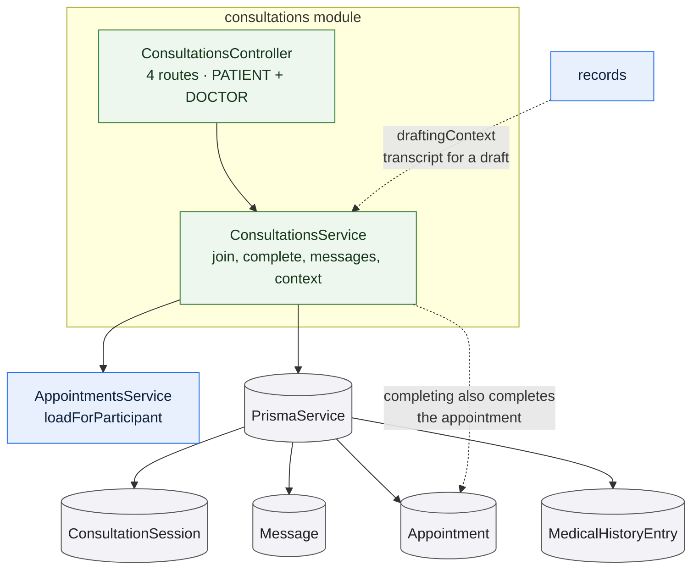

# `consultations`

Owns the room where the consultation happens: the session lifecycle, the message
thread, and the role-shaped context each participant receives. It is the only
writer of `ConsultationSession` and `Message`, and it is the transcript source
that [records](/modules/records) drafts a note from.

:::warning Fictional prototype

reMEDyo is a fictional prototype, not a real clinical service. A consultation in
a running instance is held between generated demonstration accounts, and nothing
said or shown in it constitutes care.

:::

## What it owns

**The session lifecycle.** `SCHEDULED` → `JOINED` → `IN_PROGRESS` → `COMPLETED`,
tracked on its own row so the appointment's state and the consultation's progress
are independent facts. A session row is created on demand if one is missing, so
appointments that predate the feature still work.

**The thread.** Messages between the two participants, with the sender taken
from the session and never from the request body.

**The context payload.** One route returns the appointment, the session state,
the thread, and — for the doctor only — the patient's clinical context: age
derived from date of birth, and their history bucketed into allergies, current
medications and chronic conditions.

## Joining

Whether a participant may join is decided by the **appointment's state, not by
the clock**. If the appointment is `SCHEDULED`, both participants may enter
whenever they arrive; if it is completed or cancelled, neither may. There is no
"fifteen minutes before" window and no late cutoff.

This is a deliberate departure from an earlier design. A patient who is early,
and a doctor who is running late, both belong in the room; refusing them on a
timer produces a worse outcome than letting them wait. The derived `missed` flag
follows the same reasoning — it reports that the window closed, but it does not
close the room.

Joining is **idempotent and monotonic**:

- Only the caller's own timestamp is set, so one participant's arrival never
  writes the other's.
- The state only ever moves forward. A second join cannot drag an
  `IN_PROGRESS` session back to `JOINED`.
- `startedAt` is recorded once, on the first move to `IN_PROGRESS`.

## Completing

Only the doctor can end a consultation, and only the doctor who held it — the
role check and the identity check are both required, so a different doctor on the
platform cannot close someone else's session.

Completion requires that the doctor has actually joined: *"Join the consultation
before ending it."* The session and the appointment are then completed in one
transaction, which is the only path by which an appointment becomes `COMPLETED`.

## Messaging

A message requires a **live, joined session**. Before joining, sending is
refused; after completion, or on a cancelled appointment, the thread is read-only
and the refusal says so. An empty or whitespace-only body is refused with
*"Write something first."*

Messages are append-only. There is no edit and no delete route, and the
transcript is what the doctor drafts from afterwards.

## Rules and invariants

- **Participants only.** The appointment lookup admits administrators for
  oversight purposes, so this module re-checks participation and refuses anyone
  who is neither the patient nor the doctor. As elsewhere, the refusal is `404`
  rather than `403`.
- **Clinical context is doctor-only.** The patient's payload has no
  `clinicalContext` field at all, rather than an empty one.
- **Nothing is deleted.** No route in this module deletes a session or a message.
- Sender display names are formatted at read time — the database stores no
  display name for a message.

## Data model slice

| Model | Use |
| --- | --- |
| `ConsultationSession` | Written by join and complete. One per appointment, enforced by a unique key on `appointmentId`, which is also what makes the on-demand lookup unambiguous. |
| `Message` | Inserted and read, ordered by the `(appointmentId, sentAt)` index. |
| `Appointment` | Read for authorization and state; written only to complete it. |
| `MedicalHistoryEntry`, `PatientProfile`, `User` | Read to build the doctor's clinical context and the participants' display names. |

## The transcript boundary

Drafting a note needs the transcript, but the transcript must not be exposed
through drafting to anyone but the authoring doctor. The method that supplies it
therefore performs **no authorization of its own**, and says so: the check is the
caller's. [records](/modules/records) applies the authoring-doctor rule before
calling it.

This is the one place in the API where an authorization decision is delegated
across a module boundary, and it is worth knowing about when reading either
module.
