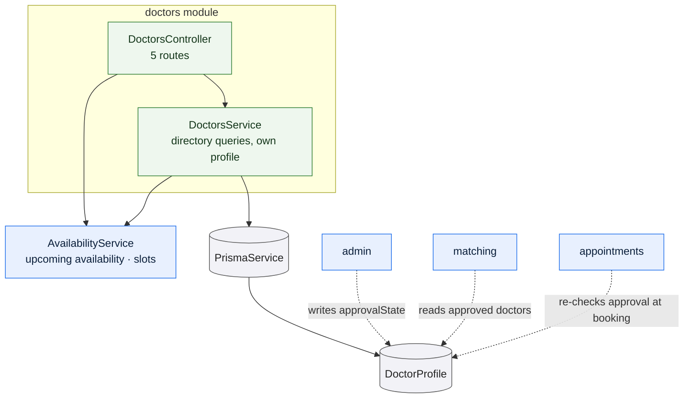

# `doctors`

Owns the clinician catalogue: the patient-facing search and detail views over
**approved** doctors, and a doctor's read and update of their own profile. It
enforces the approval gate for reads but never writes approval state — that
decision belongs to [admin](/modules/admin), and this module only reacts to it.

## What it owns

**Two views of a doctor.** A summary for lists — name, initials, specializations,
years of experience, fee, a short biography extract, and whether they have any
slot in the next seven days — and a detail view that adds the full biography, the
license number, and their soonest slots.

**Search.** Free text matches the doctor's name, or a specialization whose name
contains the term — so `cardio` finds cardiologists and `general` finds general
practitioners. Filters combine conjunctively: supplying a specialization *and* an
availability filter means both must hold. Results are ordered by years of
experience, then by name.

**A doctor's own profile**, including the rejection reason if their application
was declined. This is the only route that exposes that field.

## The approval gate

The rule is that an unapproved doctor is not listed and not bookable. Two
implementation details make it hold rather than merely intend to:

**Approval is in the query, not a filter afterwards.** Every directory query is
built with `approvalState: APPROVED` as its base condition, so there is no code
path where a forgotten check could leak an unapproved doctor into a list.

**An unapproved doctor is `404`, not `403`.** The detail lookup asks for the
doctor *and* the approved state together, and returns "That doctor is not
available" when either fails. No partial content is disclosed, and the response
does not confirm that an unapproved profile exists.

The slots route relies on this: it calls the detail lookup purely to inherit the
approval gate, discards the result, and then returns the doctor's derived slots.

## Rules and invariants

- A doctor updates only their own profile. The route takes no id — the profile is
  resolved from the session.
- Updates are partial; omitted fields are untouched, and strings are trimmed.
- **Editing a profile does not change its approval state.** A rejected doctor who
  edits their details stays rejected.
- `GET /doctors` and `GET /doctors/:id` require a session but carry no role
  restriction, so any signed-in account can browse the directory.

## Data model slice

| Model | Use |
| --- | --- |
| `DoctorProfile` | The whole of it, including `specializations`, a PostgreSQL enum array queried with `has` and `hasSome`. Looked up by `userId`, which is unique. |

Relevant enumerations: [`Specialization`](/data-model/enums#specialization),
[`ApprovalState`](/data-model/enums#approvalstate).

The `approvalState` index exists for this module's queries and for the admin
review queue.

## A note on the module wiring

`doctors` and `availability` reference each other through `forwardRef` on both
sides. The dependency is genuinely one-way at the service level —
`DoctorsService` needs `AvailabilityService` to report upcoming availability. The
cycle exists because `AvailabilityController` needs `DoctorsService` to resolve
a doctor's user id to their profile id on every route. It is an artifact of that
controller, not of the services.
