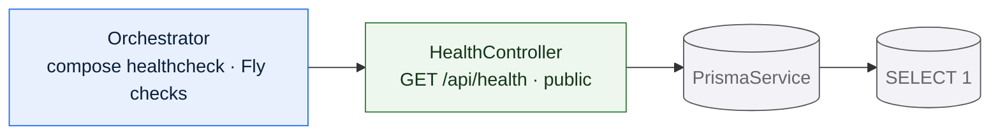

# `health`

The smallest module in the API: one route, no service layer, no data model. It
answers whether the process is running and whether it can reach the database.



## Why it is public

It is the only deliberately unauthenticated route besides sign-in and
registration. An orchestrator holds no session, and the answer discloses nothing
beyond whether the database is reachable — no counts, no versions, no
configuration.

## What it reports

```json
{ "status": "ok", "database": "up" }
```

`status` is always the literal `ok`. A failure to reach the database does **not**
produce an error response: `database` becomes `"down"` and the status code stays
`200`.

That is a deliberate distinction. The probe answers "is this process alive and
can it do its job", and a process that is running but cannot reach its database
is a specific, actionable state — one that a monitoring system should be able to
tell apart from the process being gone. Returning a `500` would collapse the two.

The database check is a single `SELECT 1`.

## What it does not check

Nothing else. There is no readiness/liveness split and no dependency check beyond
the database — a deployment with an unreachable model runtime still reports
`ok`. Model availability is a feature-level concern, reported through the
records module's assist surfaces rather than through the health probe.

## Data model slice

None. The probe issues a raw query against the connection and reads no table.

## Consumers

Both deployment shapes use it. In `docker compose` the API's healthcheck gates
the web container's start, so the frontend comes up only once the API can reach
its database. On Fly.io the same path is polled by the platform's own check. See
[Deployment](/architecture/deployment).
