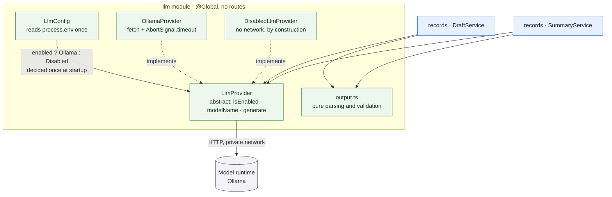

# `llm`

Owns the one place the application talks to a model: the provider interface, its
two implementations, its configuration, and the structural validation of whatever
comes back. It owns no prompt, no route, no table, and no clinical rule — those
live with the feature that uses them.

This module has **no controller and no route**. Its entire public surface is two
dependency-injection tokens, which is why it does not appear in the
[API reference](/api/) at all.

:::warning Fictional prototype

reMEDyo is a fictional prototype, not a real clinical service. The model
described here is a small language model running on commodity CPU in the same
deployment, used only to pre-fill a form and to rephrase a signed note. It is not
a medical device, its output is not clinical advice, and none of it is fit for
real medical use.

:::

## The provider seam

Two implementations of one interface:

- **`OllamaProvider`** — talks to a local Ollama server over `fetch` with an
  abort timeout. No HTTP client library is involved.
- **`DisabledLlmProvider`** — returns "not enabled" without any capability to
  make a network call at all.

**Which one is bound is decided once, at startup**, by configuration. It is not a
per-request branch. The consequence is deliberate: with generation off, no part
of the application holds an object that could call a model even by mistake.

Changing that decision requires a restart.

## Configuration

| Variable | Default | Notes |
| --- | --- | --- |
| `LLM_ENABLED` | `false` | Only the exact value `true` (case-insensitive) enables it. An unset environment is a disabled one. |
| `LLM_BASE_URL` | `http://ollama:11434` | The compose service name. |
| `LLM_MODEL` | `llama3.2:3b` | Also what is stored as provenance on generated content. |
| `LLM_TIMEOUT_MS` | `120000` | A hang ceiling, not a latency budget — CPU inference on a 3B model takes tens of seconds. |
| `LLM_MAX_TOKENS` | `800` | Response ceiling. |

The timeout is worth pausing on. Two minutes looks absurd for an HTTP call until
you remember the model is running on CPU: a note draft measures roughly 25–45
seconds on a developer laptop. The ceiling exists to bound a hang, and it is
close enough to real generation time that a slower machine will occasionally hit
it — which the surfaces report as unavailable, not as an error.

## When the model is unreachable

Every failure path returns a result rather than throwing, and all of them
collapse into the same shape:

| Cause | Reported as |
| --- | --- |
| Generation disabled | `disabled` |
| Connection refused, DNS failure, non-200 response | `unreachable` |
| The abort fired | `timeout` |
| A response that is not the JSON object expected | `invalid-response` |

Four causes, one shape, on purpose. Consumers do not distinguish them: a timeout
and a switched-off model produce the same absent-assistance state, because from
the user's point of view they are the same thing — there is no draft.

## What comes back is not trusted

Model output is parsed and validated structurally before anything uses it. This
is the module's most important boundary, and it is deliberately narrow.

- The response must be a JSON object. A bare string, a number, an array or
  malformed JSON all fail.
- Only the expected fields are kept. **Unknown keys are dropped rather than
  treated as an error**, so a chatty extra field does not discard an otherwise
  usable generation.
- A draft must carry findings, diagnosis and recommendations, each non-empty
  after trimming. A missing one fails the whole generation — there is no such
  thing as a draft with a hole in it.
- Long fields are truncated to the same limits the note form itself enforces, so
  a validated draft is always saveable.

**Validation checks shape, never clinical content.** The module makes no attempt
to judge whether a draft is medically sensible, because that judgement is not
available to it. Safety rests on the clinician's save and on the labelling of
generated content — not on automated review.

One detail of provenance worth knowing: the model name recorded on a generated
artefact is the **configured** name, echoed back, not a value read out of the
response. It says which model was asked, which is what makes what is on screen
traceable.

## What this module does not do

- It does **not** write to the database. No drafts, no summaries, no audit
  entries — persisting a generation is the consumer's job, in
  [records](/modules/records).
- It does **not** own prompts. The draft prompt and the summary prompt live with
  the module that knows what a note is.
- It does **not** decide whether assistance should be offered. It answers
  `isEnabled()`, and the caller hides the surface if the answer is no.

## Data model slice

None. This module touches no table and imports no Prisma client. Everything it
produces is a string and a model name, which the caller decides what to do with.
