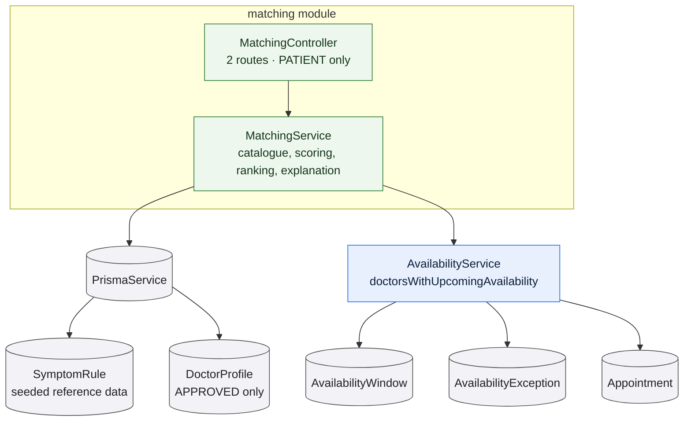

# `matching`

Owns the patient-facing intake and the ranking that follows it: a symptom
catalogue, a rule-based ranking of approved doctors for a described concern, and a
plain-language reason attached to every suggestion.

It uses **no model**. The rule table is the entire algorithm — the
clinical-assist capability requires that matching be unaffected by whether a
model is present, and the surest way to guarantee that is not to be able to call
one.

:::warning Fictional prototype

reMEDyo is a fictional prototype, not a real clinical service. Matching is not a
diagnosis and not medical advice: it ranks doctors from a seeded rule table, and
it is not a triage system. Anyone with a real concern should seek real care, and
an emergency indicator here is a demonstration of a UI state — not a substitute
for emergency services.

:::

## The rule table

`SymptomRule` is seeded reference data: each row maps a symptom to a
specialization with a **weight**, an **emergency** flag, and a list of
**keywords** for free-text matching.

Weight lives on the rule rather than on the symptom on purpose, because one
symptom can point at several specialties with different strengths. Shortness of
breath, for example, can weigh more heavily toward pulmonology than toward
cardiology while still counting for both.

The unique key is `(symptomId, specialization)`, which is what stops a symptom's
weight for a given specialty being counted twice.

## The intake

A patient describes their concern in one of three ways, or a combination:

- by selecting from the symptom catalogue;
- by writing in their own words;
- by supplying a duration and a severity.

Picked symptoms and free text then flow through **one** scoring path — free text
is matched against the same rules, by keyword.

An intake with nothing in it is refused with a patient-directed message. That is
the only error path: a valid intake always returns a result.

## How a result is produced

**Scoring.** Every rule whose symptom was matched contributes its weight to its
specialization. A single symptom therefore lifts *all* the specialties its rules
name, which is the mechanism rather than a side effect. The score is a raw sum of
integer weights — not a percentage, and not comparable between two different
intakes.

**Ranking.** Specialties are ordered by accumulated weight. Doctors within them
are then ordered by score, then by whether they have a slot in the next seven
days, then by years of experience, and finally **by doctor id**.

That last tiebreaker is the determinism guarantee: without it, two otherwise
identical doctors could come back in either order on different requests, and a
patient who retries would get a different answer.

**Explanation.** Every suggestion carries a reason naming the concerns that
produced it, built from the patient's own words where they gave any — *You
mentioned "chest pain", which Cardiology covers.*

**Availability.** Whether a doctor has a slot within seven days comes from the
[availability](/modules/availability) module, batched for all the candidate
doctors in one pass rather than queried per doctor.

**Capping.** At most six suggestions are returned, applied after the global sort.

## Emergency indicators

Some symptoms are marked as emergency indicators. If any matched rule carries the
flag, the result reports it, and the interface is expected to show prominent
guidance **ahead of** any suggestion of care.

The flag is computed from the matched rules, and is returned as a bare boolean —
the service supplies no wording. It is unaffected by whether a model is present,
which the capability spec requires explicitly.

## When nothing matches

Matching never returns an empty list for a valid intake. Two situations trigger a
fallback, and both say so rather than failing:

1. **No rule matched** the described concern.
2. **A specialty matched, but no approved doctor holds it.**

In both cases the service returns approved general-practice doctors with a
fallback flag set, and a reason that names what happened — either a general
statement, or one naming the specialty that could not be served. Every
suggestion in a fallback still carries a specialization and a reason.

## Rules and invariants

- Only **approved** doctors are candidates. Approval is part of the query, not a
  filter applied afterwards.
- Only the patient role may call either route.
- Matching is read-only. No intake is stored and no result is persisted.
- Every suggestion carries a non-empty reason.
- The result is deterministic: the same intake always produces the same list, in
  the same order.
- The response is a `200`, not a `201` — nothing is created.

## Data model slice

| Model | Use |
| --- | --- |
| `SymptomRule` | Read in full, twice per match and once per catalogue call. Shared by every patient, seeded rather than user-created, and unrelated to any other entity in the schema. |
| `DoctorProfile` | Read, filtered to `APPROVED`. |
| `AvailabilityWindow`, `AvailabilityException`, `Appointment` | Read indirectly, through the availability module's batched availability check. |

The module **writes nothing**. There is no stored intake, no stored result and no
audit entry.

`SymptomRule` is the only entity in the data model with no relation to anything
else — see the [entity relationship model](/data-model/).
