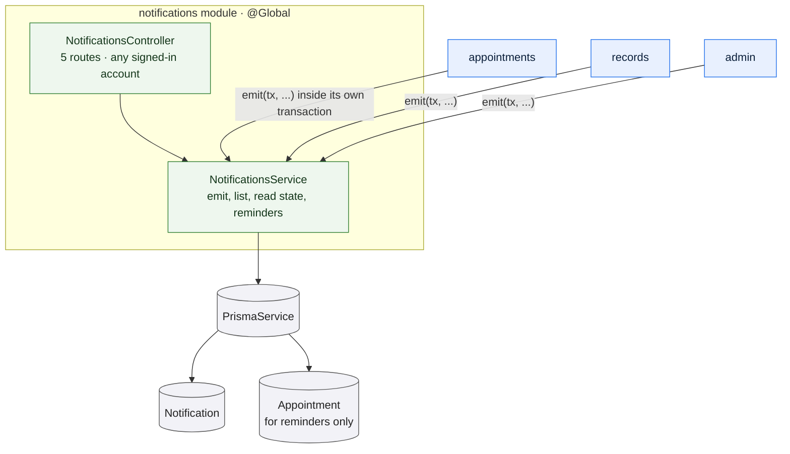

# `notifications`

Owns the in-application message surface: persisting what other modules tell it
happened, listing messages for their recipient, tracking what has been read, and
deriving imminent-appointment reminders.

It has **no producer logic of its own**. It never decides that something
happened — every stored notification is written by a caller that passes its own
transaction. The module is registered globally so any feature can do that
without a wiring change.

## Notifications are written inside the caller's transaction

`emit` takes a transaction client, and every caller passes its own. That is the
module's central invariant, and it exists for one reason: a booking that rolls
back on a slot conflict must not leave behind a notification claiming it
succeeded.

A patient who loses a booking race gets a `409` and a clear message — not a
notification about an appointment that does not exist.

## What creates a notification

| Event | Recipients | Type |
| --- | --- | --- |
| An appointment is booked | both parties | `APPOINTMENT_BOOKED` |
| An appointment is rescheduled | both parties | `APPOINTMENT_RESCHEDULED` |
| An appointment is cancelled | both parties | `APPOINTMENT_CANCELLED` |
| A note is signed | the patient, **first time only** | `RECORDS_AVAILABLE` |
| A prescription is issued | the patient, every time | `RECORDS_AVAILABLE` |
| A doctor applies / is approved / is rejected | the doctor | `DOCTOR_APPROVED`, `DOCTOR_REJECTED` |
| An account's status changes | that account | `ACCOUNT_STATUS_CHANGED` |

A revised note deliberately does **not** re-notify: the patient has already been
told their record is available, and a correction is not news. A new prescription
does notify every time.

One consequence worth stating plainly: a **suspended account cannot read the
notification telling it that it was suspended**, because a non-active account is
refused by the authentication guard on every non-public route. Reactivation is
the one status change whose notification the recipient can actually reach, which
is why the status notification carries no link.

## Stored versus derived

Two different mechanisms answer two different questions, and they do not agree
with each other — by design.

**Stored** — everything above. These are rows, with a read state, a link to the
thing they refer to, and a creation time.

**Derived** — reminders. `GET /notifications/reminders` computes, on every
request, which of the caller's appointments start within the next hour. No row is
ever written for a reminder, and `APPOINTMENT_REMINDER` is never stored despite
existing as an enumeration value.

The scope is deliberately small: only `SCHEDULED` appointments, so a cancelled or
completed one stops reminding without any cleanup. The list covers a look-ahead
of an hour, with a fifteen-minute look-behind so an appointment that started
moments ago does not vanish mid-session.

Because reminders are derived, the read state does not apply to them. They carry
a synthetic identifier prefixed with `reminder_`, which matches no stored row —
so marking one as read updates nothing and still reports success. There is no way
to dismiss a reminder.

This means the badge and the reminders list can disagree: the badge counts stored
unread rows, while reminders describe the current clock. A user can see a
reminder with a badge of zero, which is correct for both.

## Read state

Read state is a nullable timestamp, not a boolean, so *when* something was read is
preserved. Anything unread has no read timestamp.

Marking one as read is scoped to the caller in the query itself, which is what
stops one account marking another's notification read. The operation is silent
about failure — an unknown id, another account's id, and an already-read
notification all do nothing and report success. There is no `404` path.

The list is capped at the most recent 50 with no pagination, while the unread
count is not capped. An account with more than 50 unread notifications sees a
badge larger than the list.

## Rules and invariants

- Every route is scoped to the caller's own messages. No route takes a user id.
- There is no role restriction: every account has a notification list.
- No edit, no delete, and no way to mark something unread.
- Notifications cascade-delete with the account, which is one of the few cascades
  in the schema — see [constraints](/data-model/constraints#cascades).
- A repeated event is not de-duplicated. Only the first-note case suppresses a
  repeat; everything else notifies each time it happens.

## Data model slice

| Model | Use |
| --- | --- |
| `Notification` | Written, read, and marked read. Indexed on `(userId, readAt)` for the unread count and `(userId, createdAt)` for the list. |
| `Appointment` | Read only, for reminders. |

There is no unique constraint over the notification rows, so nothing at the
database level prevents duplicates — de-duplication is the producer's concern.
