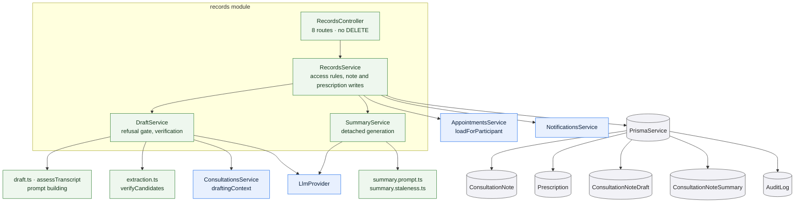

# `records`

Owns what the consultation leaves behind: the doctor's signed note, the
prescriptions issued, and the read surfaces that assemble a patient's history.
It also owns the two model-assisted artefacts — the note **draft** the doctor
edits, and the plain-language **summary** the patient reads — including when each
is refused, when a summary is stale, and what is recorded when one is generated.

It is the largest module in the API, and the one where the access rules matter
most.

:::warning Fictional prototype

reMEDyo is a fictional prototype, not a real clinical service. Every record in a
running instance is invented demonstration data. Notes, prescriptions and the
model-assisted surfaces described here must not be used for any real clinical
purpose.

:::

## There is no delete route

The controller has no `DELETE` anywhere, and no file in the module calls a Prisma
delete. Notes are revised in place; prescriptions are append-only; drafts and
summaries are superseded. Record retention is enforced by the absence of a route
rather than by a rule someone has to remember, and the schema's cascade
declarations describe ownership rather than a path anyone can take.

## The authoring-doctor rule

One check guards every write: a caller may write a note, issue a prescription,
or read a draft **only if they are a doctor and they are the doctor on that
appointment**. It is role *and* ownership, not role alone — holding the doctor
role is not enough to write someone else's record.

The refusal is explicit about which rule failed rather than silently returning
nothing.

A second gate applies to all three writes: **the consultation must be completed
first**. A draft, a note or a prescription attempted on a scheduled appointment
is refused. In practice this means a doctor writes up a finished consultation.

## Reading

| Reader | What they may read |
| --- | --- |
| The patient | Their own record, whole. Resolved from the session — no id is accepted. |
| A doctor | Any patient's record, **if a relationship exists**: at least one appointment, in any state, between that doctor and that patient. |
| Either participant | The record entry for one appointment. |
| An administrator | The record entry for one appointment, through the same participant check. |

The doctor's access rule is worth stating precisely, because it is not
role-based. It is a query: *have these two ever been in an appointment together?*
Booking a first appointment is therefore what grants a doctor sight of that
patient's record, and once the relationship exists the doctor sees the whole
record — including entries written by other doctors. A doctor with no such
relationship gets `404`.

Neither the patient's `assist` route nor any record route is public: the assist
availability flag says something about the deployment's configuration, so it
requires a session.

## The note

A note has findings, a diagnosis, recommendations and optional follow-up. Saving
again **revises** it: the row keeps its identity and its `updatedAt` moves. That
timestamp is not decoration — it is what the summary staleness rule reads.

`aiAssisted` records whether the doctor started from a generated draft. It is
**declared by the authoring interface at save time**, so it is a provenance
marker rather than a control: the existence of a draft row is not evidence that
the doctor used it. It is stored but not returned by any route.

The patient is notified the first time a note is signed, and only the first time
— a revision is not news.

## Prescriptions

Appended, never revised and never deleted. A prescription records the medication,
dosage, frequency, duration and optional instructions, and the patient is
notified each time one is added.

Because there is no revision path, a mistaken prescription cannot be corrected
through the application — a consequence of the retention rule rather than an
oversight.

## The note draft

The draft is scaffolding for the doctor's form. It pre-fills a form that the
doctor must still save; it is never the record, and no route serves it to a
patient.

Generation is refused — as a successful `200` with `status: "refused"`, not an
error — in four cases, checked in this order:

1. **The transcript is too thin.** Checked before the model is ever called, so
   the refusal is deterministic and costs nothing. Empty, fewer than four
   messages, fewer than two from each participant, or under 200 characters in
   total all refuse.
2. **Assistance is disabled** for this deployment.
3. **The model could not be reached**, timed out, or returned something
   unparseable.
4. **The output failed validation** — a draft missing a diagnosis is a failed
   generation, not a draft with a hole in it.

All four collapse to one absent-assistance state in the interface. The reasons
are distinguished in the response body, but the three refusal values render the
same way.

### Extraction candidates

A draft may propose prescription values read out of the doctor's own messages.
Every candidate is verified before it is offered, and the verification is
deliberately not a prompt instruction but a property of the code:

- the message it cites must be one of **this appointment's** loaded messages;
- that message must have been sent by **the authoring doctor**;
- the quoted excerpt must actually occur in that message's text.

Anything that fails is dropped silently. A candidate missing a field is dropped
too — a partial extraction is a guess, not a pre-fill.

**Candidates never become prescriptions.** They are stored as JSON on the draft,
and the only way a `Prescription` row comes into existence is the doctor's own
save through the prescription route.

## The record summary

The summary is the patient-facing, plain-language rendering of a signed note. It
is generated from the **note and its prescriptions only** — never the transcript
and never the draft — which the prompt builder enforces by accepting nothing
else.

**When a summary is shown.** Only while it still describes the note's current
version. The rule is a comparison: the summary stores the note's `updatedAt` at
the moment it was generated, and it is served only while that still equals the
note's `updatedAt` now. Any revision makes the comparison fail and the summary
disappears from the response — replaced by `null`, not by a stale copy. Nothing
is deleted, and there is no invalidation job.

**How it is generated.** Detached from the request that triggered it. A read that
finds a missing or stale summary schedules generation and returns immediately, so
the page keeps its latency and an absent summary is one correct state. Generation
is skipped entirely when assistance is disabled.

When generation finishes, the note is **re-read** before the result is stored: if
the note was revised while the model was working, the result explains a
superseded version and is discarded rather than stored. The honest failure is
"no summary", not "a summary of the wrong thing".

Saving a note is never blocked by generation — it is scheduled after the
transaction commits, for the reason that a generation must never sit in the path
of the most important write in the product.

## Rules and invariants

- Authorization is role *and* ownership, checked on every write.
- Reading a patient's record requires an appointment relationship, not a role.
- Non-participants get `404`; the response never confirms a record exists.
- Assisted content never reaches the record without a clinician's save.
- Generation failures are swallowed into a log line. The product reports absent
  assistance rather than an error.
- Every generation that produces content writes an audit entry naming the model
  used. The actor recorded is **whoever's read triggered it**, which for a
  summary is often the patient opening their own records rather than the doctor
  whose note it summarises.

## Data model slice

| Model | Use |
| --- | --- |
| `ConsultationNote` | Revised in place. Unique on `appointmentId`, so there is exactly one per consultation. `updatedAt` is the summary staleness key. |
| `Prescription` | Append-only, indexed on `appointmentId`. |
| `ConsultationNoteDraft` | One live draft per appointment, overwritten on regeneration. Candidates live as JSON on this row, not in their own table — they have no independent identity. |
| `ConsultationNoteSummary` | One per appointment, carrying the `noteUpdatedAt` it explains. |
| `AuditLog` | Insert-only. `NOTE_DRAFT_GENERATED` and `RECORD_SUMMARY_GENERATED`, both naming the model. |
| `Appointment`, `PatientProfile`, `DoctorProfile`, `User` | Read for authorization and display names. |

The separation of `ConsultationNoteDraft` and `ConsultationNoteSummary` from
`ConsultationNote` is what makes "no generated text reaches the record without a
clinician's save" structural: exactly one route writes the note table, and no
model writes to it. See [the data model](/data-model/).
