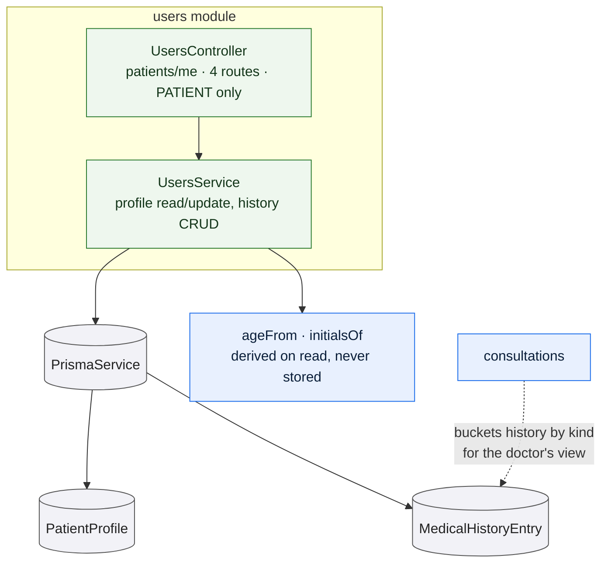

# `users`

Owns the patient's own profile: the contact and physical details a doctor reads
before a consultation, and the medical history the patient chooses to share.
Every route is scoped to the caller's session — there is no route here to read
another patient's profile — and the module is patient-only, declared once at the
controller level.

It is a small module. That is the point: the doctor's side of this data is not
served from here at all.

## What it owns

**The profile.** Name, date of birth, contact number, weight and height. Updates
are partial: a field left out of the request is left untouched, and a field sent
as whitespace becomes `null` rather than an empty string.

**Age is derived, never stored.** It is computed from the date of birth on every
read, with a real month-and-day comparison rather than dividing by 365. A stored
age would be wrong within a year of being written.

**The date of birth is validated in the service, not only at the DTO.** A value
that does not parse is rejected, and so is a date in the future.

**The medical history.** Four kinds — allergy, medication, chronic condition and
a free note — always returned newest first. This is what the consultation
workspace groups into the doctor's clinical context, so the kinds are the shape
of that panel.

## Rules and invariants

- Every route resolves the caller's `PatientProfile` by user id first and returns
  `404` if there is none. The profile is the key, not the user.
- Removing a history entry owned by someone else returns `404`, deliberately not
  `403`. An entry that belongs to another patient must be indistinguishable from
  one that does not exist; anything else confirms the entry is real.
- Measurement bounds are enforced at the DTO: weight 1–500 kg, height 20–280 cm.
  Values are stored as given, in kilograms and centimetres, with no conversion.

## Data model slice

| Model | Use |
| --- | --- |
| `PatientProfile` | The whole of it. Looked up by `userId`, which is unique. |
| `MedicalHistoryEntry` | Written and removed by the patient. The foreign key is to `PatientProfile.id`, not to `User.id` — which is why every operation resolves the profile first. |

The history is indexed on `(patientId, kind)`, which is exactly the grouping the
consultation workspace performs.

## Where the doctor reads this

Not here — and that is deliberate. The doctor-facing view of a patient's history
is assembled in [consultations](/modules/consultations), which buckets
`MedicalHistoryEntry` rows by kind and attaches them to the consultation context
for the treating doctor only. Keeping the two surfaces apart means the patient's
own profile route can never be reached with another patient's id.
